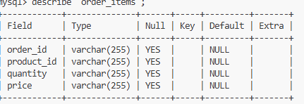
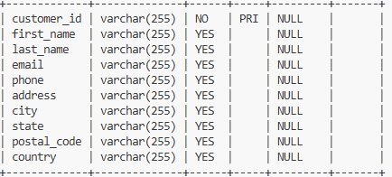

### **1. Explore the Schema**
-connection a la base de donnees: mysql -u root -p
-use databases:
    

-use  kinternship2025;
-show Database kinternship2025; : 

-select * from customers; : 

-select * from order_items;

-select * from orders; 

-select * from payments; 

mysql> select * from  products;

-descirbe order_items; 
    primary_key: order_id
    foreign_key: product_id
    quantity: varchar(225);

-describe customers;

diagram: 